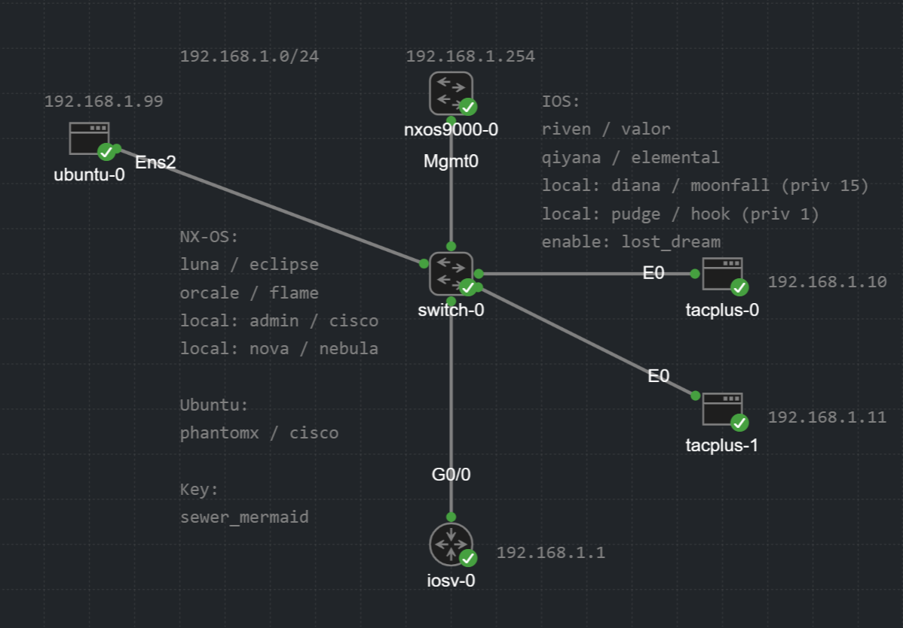

# AAA & TACACS+ Configuration Guide

AAA (Authentication, Authorization, Accounting) is a security framework for controlling and auditing administrative access to network devices. It answers three distinct questions:

- Authentication: Who are you? Verify identity before granting any access.
- Authorization: What you are allowed to do? Constrain commands and privilege levels per users.
- Accounting: What did you do? Log activity for auditing, forensics, and compliance. 

### Common protocols that implement this framework include:

- RADIUS (Remote Authentication Dial-In User Service)
- TACACS+ (Terminal Access Controller Access Control System Plus)

| | RADIUS | TACACS+ |
|---|---|---|
| Transport | UDP (auth 1812, acct 1813) | TCP (49) |
| Encryption | Password attribute only | Entire packet body |
| AAA model | Combines authN + authZ | Separates all three independently |
| Command-level control | Limited | Per-command, per-privilege-level |
| Typical use | Network access (802.1X, VPN, Wi-Fi) | Router/switch/firewall admin |
| Origin | Open standard (RFC 2865) | Cisco-developed (RFC 8907) |

## Set up



## NX-OS Configuration

### Step 0: Prequiist (Connectivity + SSH)

```
ssh key rsa 2048 force
feature ssh
ssh login-attempts 3
ssh login-gracetime 60
no feature telnet

interface mgmt 0
    ip address 192.168.1.254/24
    vrf member management
```

Verify reachability to the AAA server:

```
ping 192.168.1.10 vrf management

show ip arp vrf management 
clear ip arp 192.168.1.10 vrf management
```

### Step 1: Enable the feature, define key and servers

```
feature tacacs+

tacacs-server key sewer_mermaid
tacacs=server host 192.168.1.10
tacacs-server host 192.168.1.11
```

### Step 2: Define the server group

```
aaa group server tacacs+ TAC_GROUP
    server 192.168.1.10
    server 192.168.1.11
    use-vrf management
    source-interface mgmt0
    deadtime 5
```

### Step 3: Authentication

```
aaa authentication login default group TAC_GROUP local
aaa authentication login console group TAC_GORUP local
aaa authentication login error-enable
aaa authentication login ascii-authentication
```
### Step 4: Authorization
```
aaa authorization config-commands default group TAC_GROUP local
aaa authorization commands default group TAC_GROUP local
```

### Step 5: Accounting
```
aaa accounting default group TAC_GROUP
```

## IOS / IOS-XE Configuration

### Step 0: Prerequisites (connectivity + SSH)

```
hostname spectre spectre 
ip domain-name phantomx.local

crypto key generate rsa modulus 2048

ip ssh version 2
ip ssh time-out 60
ip ssh authentication-retries 3

interface GigabitEthernet 0/0
    ip address 192.168.1.1 255.255.255.0
    no shutdown
```

### Step 1: Create a local fallback user

```
username diana privilege 15 secret moonfall
enable secret lost_dream
```

### Step 2: Enable AAA, define key and servers

```
aaa new-model

tacacs server TAC1
    address ipv4 192.168.1.10
    key sewer_mermaid

tacacs server TAC2
    address ipv4 192.168.1.11
    key sewer_mermaid

aaa group server tacacs+ TAC_GROUP
    server name TAC1
    server name TAC2
    ip tacacs source-interface GigabitEthernet 0/0
```
### Step 3: Authentication

aaa authentication login default group TAC_GROUP local
aaa authentication enable default group TAC_GROUP local

Apply method lists to  the lines:

```
line vty 0 4
    exec-timeout 10 0
    transport input ssh
    logging synchronous
    
    transport input ssh

line vty 5 15
    input transport none

line console 0
    exec-timeout 5 0
    logging synchronous
```
### Step 4: Authorization

```
aaa authorization exec default group TAC_GROUP local
aaa authorization commands 1 default group TAC_GROUP local
aaa authorization commands 15 default group TAC_GROUP local
```

### Step 5: Accounting

```
aaa accounting exec default start-stop group TAC_GROUP
aaa accounting commands 1 default start-stop group TAC_GROUP
aaa accounting commands 15 default start-stop group TAC_GROUP
```

### Step 6: Verify (IOS)

```
test aaa group TAC_GROUP diana moonfall legacy
show tacacs
show aaa servers
debug tacacs 
debug aaa authentication
```